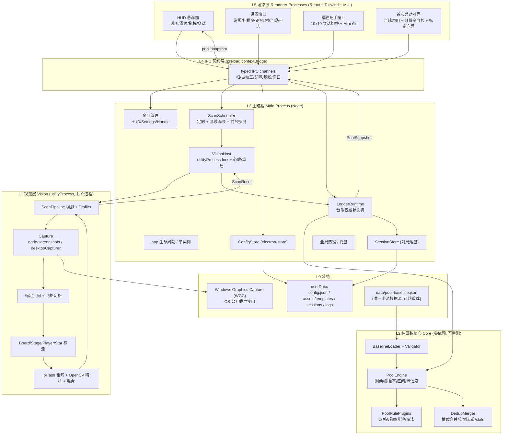
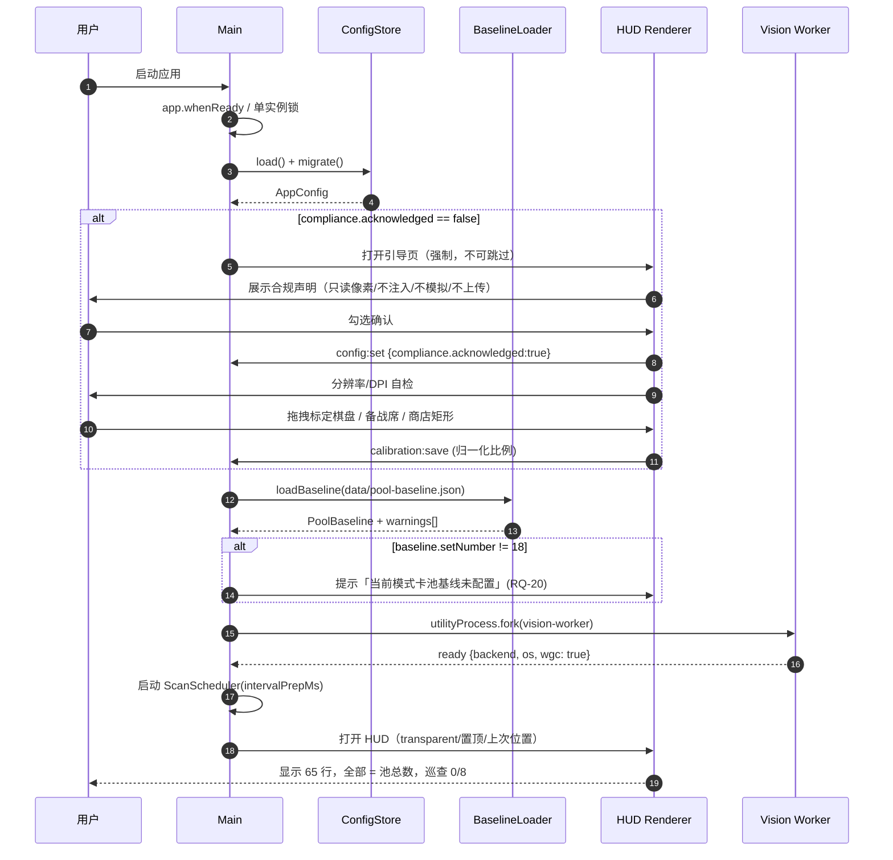
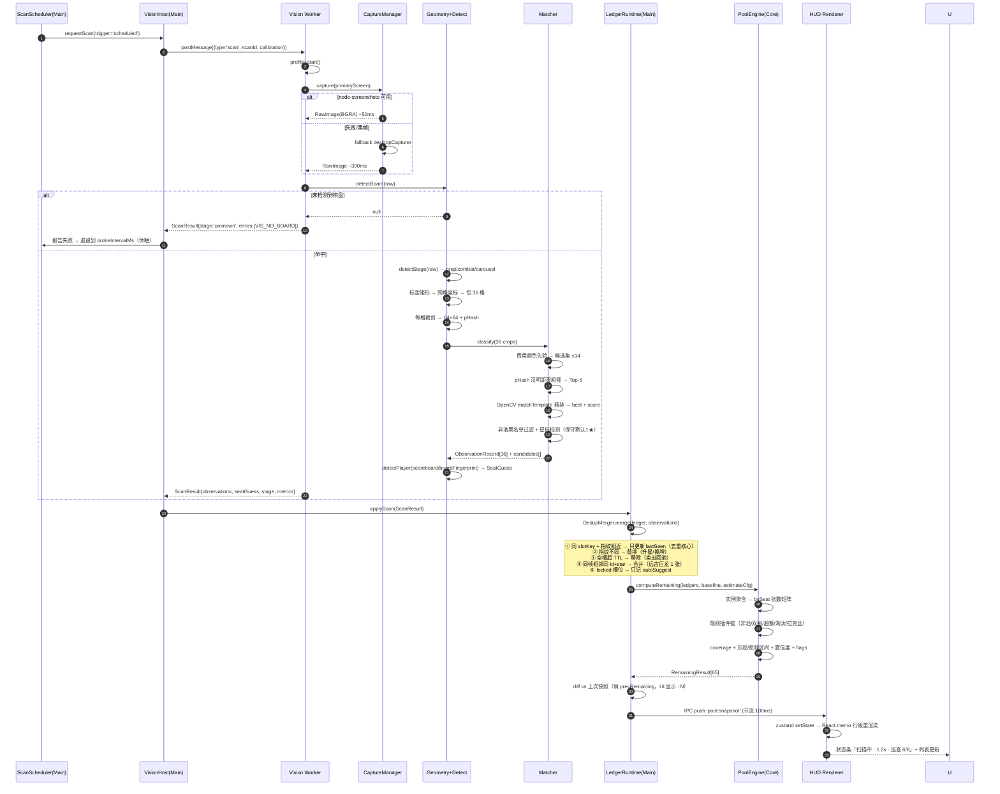
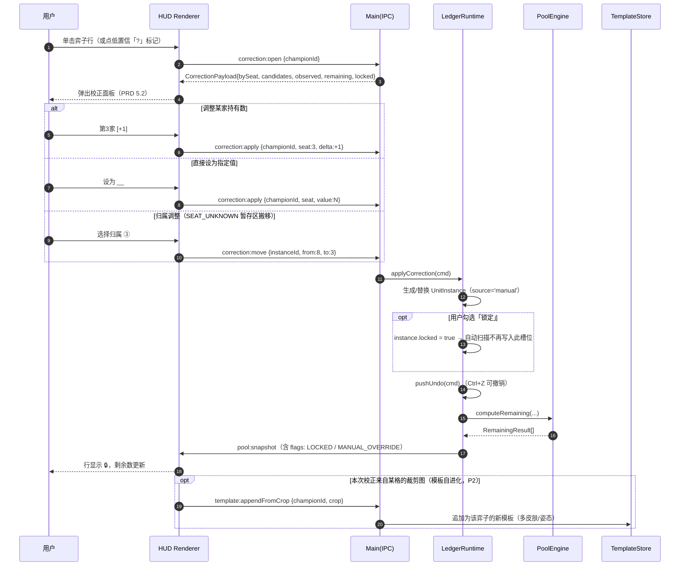
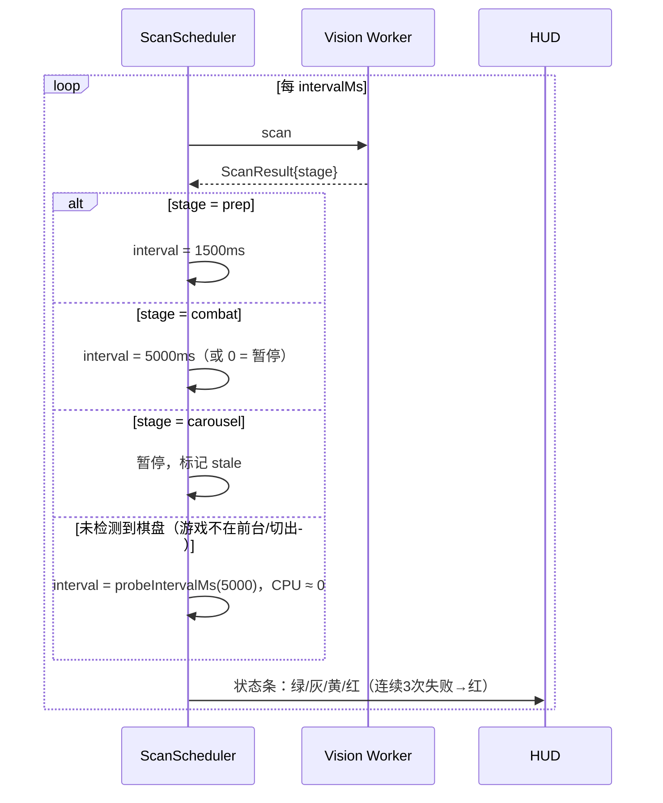
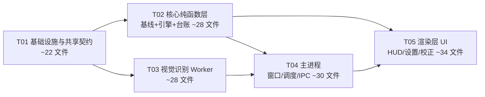

# TFT 牌库剩余计数器 — 系统架构设计与任务分解

| 项目 | 内容 |
| --- | --- |
| 项目名 | `tft-pool-counter` |
| 形态 | Windows 桌面悬浮窗（Electron，透明置顶） |
| 目标赛季 | TFT Set 18「自然之力 / Enchanted Wilds」 |
| 文档版本 | v1.0 |
| 撰写 | 高见远（架构师） |
| 输入 | `docs/PRD.md` v1.0（许清楚）、`data/pool-baseline.json`（CONFIRMED: false） |
| 输出 | 本文件 + `docs/class-diagram.mermaid` + `docs/sequence-diagram.mermaid` |

---

## 0. 设计摘要（先看这一页）

| 维度 | 结论（一句话） |
| --- | --- |
| 进程架构 | **主进程（窗口/调度/台账宿主） + Vision Utility Process（截图+CV，独立进程） + 2~3 个渲染进程（HUD / 设置 / 常驻把手）** |
| 截屏 | **主选 `node-screenshots`（Rust/WGC，直出 BGRA Buffer）**；回退 Electron `desktopCapturer`；最后手段自写 C++ WGC addon |
| 识别 | **「棋盘/备战席标定矩形 → 网格切格 → 费用颜色先验 → pHash 粗筛 → OpenCV(WASM) matchTemplate 精排 → 星标检测」**；**名称 OCR 不进主链路**（棋盘上没有文字可 OCR），仅作素材采集/兜底 |
| 计算 | **`src/core` 纯函数层，零 electron/node 依赖，Vitest 100% 可单测**；特殊机制走 `PoolRulePlugin` 插件链 |
| 去重 | **以 `(seat, zone, slotIndex)` 为键的槽位台账（幂等覆盖，非累加） + 图像指纹 stability 判重 + 同帧相邻槽位实例合并 + stale 清理** |
| 状态 | 权威状态在主进程；渲染进程用 zustand 持有快照副本；`electron-store` 存配置，对局台账可选落盘 |
| UI | Vite + React 18 + **Tailwind 写 HUD 高频重绘表行，MUI 只用于弹层/表单/设置页**；`@tanstack/react-virtual` 虚拟滚动 |
| 合规 | 全链路只用 OS 公开截屏接口；**代码中不存在任何进程句柄、内存读写、输入模拟、网络上传路径**；`src/shared/forbidden-apis.md` 作为审查清单 |

---

## 1. 架构总览

### 1.1 分层图



### 1.2 进程与线程模型

| 进程 | 类型 | 职责 | 为什么这么放 |
| --- | --- | --- | --- |
| Main | Electron main | 窗口、调度、台账状态机、持久化、热键、托盘 | 唯一权威状态源，渲染进程崩了不丢台账 |
| **Vision Worker** | `utilityProcess.fork()` | 截屏、CV、产出 `ScanResult` | **硬性要求：不阻塞 UI**。utilityProcess 是完整 Node 进程，可加载 native 模块；崩溃可自动重启不影响主窗口 |
| HUD Renderer | BrowserWindow | 悬浮窗 UI | 每 1.5s 收一次快照，只做渲染 |
| Settings Renderer | BrowserWindow（按需创建，关闭即销毁） | 设置/日志/素材向导 | 不常驻，省内存 |
| Handle Renderer | BrowserWindow 10×10 | 穿透态下的常驻可点区 | 解决"穿透后锁死"问题（见 4.6） |

**关键约束**：截图与识别**绝不**出现在任何渲染进程或主进程的同步路径上。主进程只做 `postMessage` 与结果接收。

### 1.3 数据流（单向）

```
屏幕像素
  → [Vision Worker] ScanResult { observations[], stage, seatGuess, metrics }
  → [Main] LedgerRuntime.applyScan()  ← 去重/合并/stale 在这个环节
  → [Core] PoolEngine.compute()       ← 纯函数，输入台账 + 基线
  → [Main] PoolSnapshot { rows[65], coverage, meta }
  → [IPC push] zustand → React 渲染
```

---

## 2. 技术选型决策记录（ADR 摘要）

### ADR-01 屏幕捕获方案

**候选**

| 方案 | 延迟 | 依赖 | 风险 |
| --- | --- | --- | --- |
| A. Electron `desktopCapturer` + `chromeMediaSourceId` | 200–800ms（首帧更慢，需 video.play + drawImage + getImageData） | 零额外依赖 | **全屏 DX 游戏可能黑帧**；`getSources` 对无标题窗口识别困难；每帧 8MB RGBA，走 Chromium 媒体管线开销大；Electron 版本升级行为易变 |
| B. `screenshot-desktop` | 300–600ms | 纯 JS，内部调 PowerShell/.NET | 慢、不稳定、依赖系统 PowerShell 策略，达不到 1.5s 预算 |
| **C. `node-screenshots`（Rust napi，Windows 走 WGC）** | **30–80ms，直出 Buffer（BGRA/RGBA）** | 预编译 `.node`，**无需 node-gyp 编译** | 包维护活跃度/版本可用性需安装时核实；若预编译缺失则退化为需要 Rust 工具链 |
| D. 自写 C++ WGC addon | 20–50ms，可控性最高 | node-gyp + MSVC 生成工具 + Windows SDK 10.0.22621 | 开发成本高 3~5 人日，用户安装也无需编译（要预编译分发） |
| E. 捆绑 C#/Rust helper exe，stdio 通信 | 40–90ms | 无需 node ABI 兼容 | 多一个进程 + 协议层 |

**结论**：**主选 C（`node-screenshots`），回退 A（`desktopCapturer`），最后手段 D**。
在 `CaptureManager` 中用**策略模式**同时实现 A/C，启动时做一次"能力探测"（连续 3 帧非纯黑且方差 > 阈值 → 判定可用），失败自动降级，并在设置页显示"当前捕获后端"。这样即使 C 的预编译二进制在某台机器上不可用，产品仍能跑（代价是延迟上升、可能需用户改用无边框窗口模式）。

**已知坑（必须写进代码注释）**
1. Windows 10 2004+ 才支持 WGC；低于此版本只能走 GDI（`BitBlt`），DX 游戏会黑屏 → 需在启动时检测 `os.release()` 并提示。
2. **独占全屏（Exclusive Fullscreen）**下 WGC 捕获可能触发游戏分辨率切换闪烁或返回黑帧。**兜底引导：HUD 提示"请在游戏中切换为无边框/窗口化全屏"**。这是唯一可靠解，必须在首次引导页说明。
3. 混合 DPI / 多显示器：截图 Buffer 的像素尺寸 = 物理像素 × `scaleFactor`。所有几何计算统一在**物理像素坐标系**，UI 显示层再除以 `devicePixelRatio`。
4. 全屏 DX 应用下 Electron `alwaysOnTop: 'screen-saver'` 仍可能被覆盖 → 见 ADR-07。

**代价**：引入一个 native 二进制依赖（约 2–6MB），需在 `electron-builder` 中正确 `asarUnpack`，CI 需 Windows runner。

---

### ADR-02 弈子识别方案（本项目最难的部分）

**先破一个误区**：TFT 棋盘/备战席上**没有弈子名称文字**（只有头像、星级角标、费用边框、羁绊光效），弈子名只在鼠标 hover 时以 tooltip 出现。因此 **"OCR 名称" 在棋盘主链路上根本不适用**。OCR 只能用于：① 计分板玩家 ID；② 商店卡片名（P1）；③ 素材采集向导里自动给裁剪图标命名。

**候选对比**

| 方案 | 准确率上限 | 单帧耗时 | 素材成本 | 赛季更新成本 |
| --- | --- | --- | --- | --- |
| ① 纯 OCR 名称（tesseract.js / PaddleOCR） | 低（无文字可认） | 200–800ms/格（中文包 ~15MB） | 无 | — |
| ② 全局模板匹配（65 模板滑窗搜全屏） | 中 | 数秒（不可接受） | 65 张 | 重采 |
| ③ **标定网格切格 + 费用先验 + pHash 粗筛 + matchTemplate 精排** | **高（>95% 可达）** | **~250ms（36 格）** | 65 张头像模板 | 重采（有向导，~10 分钟） |
| ④ ③ + 小型 CNN/ONNX 分类头 | 最高 | ~300ms | 需标注集（≥ 每弈子 20 张） | 需重训 |
| ⑤ ③ + 颜色直方图/羁绊光效交叉校验 | 高 + 抗皮肤 | +30ms | 无 | 无 |

**结论（可渐进落地）**

- **MVP（P0）= ③ + ⑤**：
  1. **标定（Calibration）**：首次引导页让用户拖拽 3 个矩形（己方半场棋盘 / 备战席 / 商店），存为**相对屏幕宽高的归一化比例**，不存绝对像素。→ 彻底规避分辨率/缩放/UI 尺寸硬编码失效问题。
  2. **网格切分**：棋盘 4 行 × N 列、备战席 1 行 × M 槽（N/M **可配置，默认 7 列 / 8 槽，S18 实测校准**），按标定矩形等分，每格取中心 72% 区域裁剪并归一化到 64×64。
  3. **费用先验**：采样格子底部费用条的颜色（1 灰白 / 2 绿 / 3 蓝 / 4 紫 / 5 金），把 65 类问题降到 ≤14 类 —— **这是准确率与性能的关键一招**。
  4. **pHash 粗筛**：与同费用档模板比汉明距离，取 Top-5。
  5. **OpenCV(WASM) `matchTemplate` TM_CCOEFF_NORMED 精排**：对 Top-5 模板算归一化相关系数，取最高分为 `championId`，分数映射为 `confidence`。
  6. **星级检测**：独立星标角标模板 + 镜内亮度/面积统计；**不确定时保守默认 1★ 并标低置信**（低星 = 少算 = 高估剩余，误差方向更安全）。
  7. **非池单位过滤**：`non-pool-units.json` 黑名单 + "无法匹配到任何模板且置信度 < 阈值"的格子直接丢弃（解决 E5）。
- **V1.1（P1）= ④ 可选 ONNX**：`onnxruntime-node`（预编译）加载一个 65 类轻量分类头，**仅在 MVP 置信度 < 0.7 的格子上启用**（跑 36 格中的少数几格，耗时可控）。
- **V2（P2）= 用户反馈驱动的模板自进化**：用户每次手动校正，若校正的格子有裁剪图，自动把该裁剪图追加为该弈子的新模板（多皮肤/多姿态），写入用户模板库。**越用越准**。

**素材从哪来（首版冷启动）**
1. `data/templates/champions/*.png` 仓库内置一份**占位模板集**（64×64，从公开图鉴站点头像整理；来源与授权声明写在 `data/templates/manifest.json`，首次启动弹"素材来源与免责"确认）。
2. **素材采集向导（P0 必须有）**：设置页 → "识别素材" → 用户截一屏自己的满备战席 → 工具自动切格 → 用户在下拉里给每格选弈子名 → 一键生成/覆盖用户模板库。
3. **导入/导出 zip**：`templates-<set>-<patch>.zip`，社区共享；`manifest.json` 记录 `setNumber / patch / sourceResolution / 生成者`。

**代价**：MVP 强依赖模板质量与标定准确性；皮肤/特效会拉低置信度 —— 由"低置信高亮 + 一键校正 + 模板自进化"兜底，这正是 PRD 要求"手动校正是一等公民"的原因。

---

### ADR-03 牌库推算引擎

**结论**：`src/core/pool-engine` 为**纯函数模块**：
- 不 import `electron` / `node:fs` / 任何 native；
- 输入 `(PlayerLedger[], PoolBaseline, EstimateConfig)`，输出 `RemainingResult[]`；
- **特殊机制用 `PoolRulePlugin` 插件链**（`src/core/pool-engine/rules/`），新增机制只加一个文件 + 注册，不改主流程；
- 100% 覆盖单测，`tests/goldens/` 放 PRD 6.5 算例 A/B/C 的 JSON 数据集。

**可插拔插件清单**

| 插件 | 作用 | 触发条件 |
| --- | --- | --- |
| `non-pool-filter` | 丢弃黑名单单位（E5） | 识别阶段已过滤，引擎层二次兜底 |
| `double-slot` | 远古巨龙 `teamSlots=2` 但 `poolCopiesConsumed=1` | `champion.special` 存在 |
| `star-copies` | 1★=1 / 2★=3 / 3★=9 / 4★=9 | 恒定 |
| `duplicator-overflow` | `observed > poolTotal` 时 `remaining` clamp 到 0，打 `OVERFLOW_DUPLICATOR` 标记并显示 `+N 复制器`（**不显示负数**） | `observed > poolTotal` |
| `elimination` | 玩家被淘汰 → 该 seat 台账清空 → 剩余自动回升 | `ledger.status === 'eliminated'` |
| `sell-return` | 快照口径天然支持（槽位消失即回池），引擎层无需实现，仅在 UI 打 `↑N` 变化提示 | — |
| `lux-avatar` | 拉克丝全形态共享同一池，按单一 `championId` 计数 | `champion.id === 'lux'` |

---

### ADR-04 去重 / 合并策略（最关键的坑）

**问题**：同一玩家被反复扫描，若"每次扫描的观测都累加"，剩余数会暴跌到负数。

**结论：台账模型 = 槽位（Slot）为键的幂等覆盖，而不是事件日志的累加。**

```
ledger.slots: Map<slotKey, UnitInstance>
slotKey = `${seat}|${zone}|${slotIndex}`
```

**更新算法（`DedupMerger.merge`）**

1. **命中同槽位**（`slotKey` 已存在）：
   - 若 `fingerprint` 汉明距离 ≤ `SAME_FINGERPRINT_THRESHOLD`（默认 6）→ **判定为同一实例**：只更新 `lastSeenAt`、`confidence`（取滑动最大值）、不新增。→ **这就是去重的核心**。
   - 若指纹差异大 → 判定为换牌/升星：**替换**该槽位记录（旧记录进 `history` 环形缓冲，供撤销/复盘）。
2. **空槽位**：若该槽位被识别为"空"，且旧记录 `lastSeenAt` 距今 > `STALE_TTL_MS`（默认 8s）→ 移除（卖出/被淘汰，回池）；≤ TTL 则保留并标 `UNSTABLE`（防抖动/特效遮挡导致误删）。
3. **同帧相邻槽位合并**：对 `teamSlots > 1` 的弈子（远古巨龙），把水平/垂直相邻且 `championId + star` 相同的槽位合并为**一个实例**，只计 1 张（解决 E8）。
4. **人工覆盖优先**：槽位被 `locked` 时，**自动扫描结果完全不写入该槽位**，只记录 `autoSuggest`（供 UI 显示"系统建议 N"，不覆盖用户值）。
5. **seat 未识别时**：写入 `seat = UNKNOWN_SEAT(8)` 的暂存区，UI 提示"未识别归属，请指定"；用户指定后一次性搬移到目标 seat。绝不猜。
6. **幂等性自检**：`applyScan` 对同一 `ScanResult` 重复执行两次，台账必须完全相同（有单测保证）。

---

### ADR-05 "当前是第几家"的判定

合规禁止模拟输入 → 工具不能自动切视角，只能被动识别当前画面属于谁。

**三级判定链（`player-detector.ts`）**

| 级别 | 依据 | 置信度 |
| --- | --- | --- |
| L1 计分板高亮 | 识别左右两侧计分板中被高亮/放大的玩家行 → 其序号 = seat | 0.9 |
| L2 棋盘指纹比对 | 对当前己方半场棋盘做整块 pHash，与台账中已存各 seat 的 `boardFingerprint` 比对，命中即该 seat | 0.75 |
| L3 未知 | 都不命中 → 写入 `UNKNOWN` 暂存区，HUD 状态条黄灯 + 提示"请点选当前是第几家"（1 次点击） | 0 |

**幂等保证**：L1/L2 命中已有 seat → **覆盖更新该 seat 的全部槽位**（先清空该 seat 再写入），天然避免重复累加。这是 RQ-05②"重复巡查同一家时覆盖更新而非叠加"的实现。

---

### ADR-06 状态管理与持久化

| 数据 | 存放 | 生命周期 | 方案 |
| --- | --- | --- | --- |
| 权威台账 | 主进程内存 `LedgerRuntime` | 一局 | zustand 不用在 main，直接普通对象 + reducer（`core/ledger/ledger-store.ts` 是纯函数 reducer） |
| UI 快照 | 渲染进程 zustand | 跟随窗口 | `pool:snapshot` IPC 推送，节流 100ms |
| 应用配置 | `userData/config.json` | 永久 | `electron-store` + schema 校验 + 迁移函数 `migrate(from,to)` |
| 对局记录 | `userData/sessions/<ts>.json` | 近 20 局 | 可选（RQ-23），默认关闭 |
| 模板素材 | `userData/assets/templates/` | 永久 | 文件系统 + `manifest.json` |
| 日志 | `userData/logs/main.log` | 滚动 3×5MB | `electron-log` |

**为什么不用 Redux**：状态量小（65×8）、更新频率中等（0.67Hz）、无需时间旅行调试（校正撤销由专门的 `UndoStack` 负责）→ zustand 更轻（~1KB），且天然支持 `subscribeWithSelector` 做选择性重渲染。

---

### ADR-07 UI 技术栈

默认栈 **Vite + React + MUI + Tailwind**，做一处调整：

> **HUD 的高频重绘部分（65 行列表、进度条、点阵）用 Tailwind 原子类；MUI 只用于弹层（Dialog/Menu/Tooltip）、表单控件、设置页。**

**理由**：HUD 每 1.5s 全量刷新 65 行，MUI/emotion 的运行时 CSS-in-JS 会产生可观的样式计算开销与 GC 压力；Tailwind 是编译期 CSS，行组件用 `React.memo` + 稳定 key 即可把重渲染成本压到最低。MUI 在弹层/设置页这类低频、交互复杂的场景价值最大，予以保留。

其余要点：
- 虚拟滚动：`@tanstack/react-virtual`（65 行其实不必，但 P1 的关注区扩展与低配机仍需要，且它比 `react-window` 的 TS/动态高度支持更好）。
- 主题：`theme.ts` 定义三套（dark / light / high-contrast），用 CSS 变量 + `data-theme` 属性切换，避免重挂载。
- 悬浮窗：`transparent + frame:false + skipTaskbar + hasShadow:false`，`setAlwaysOnTop(true, 'screen-saver')`。
- **点击穿透**：`setIgnoreMouseEvents(true)`；穿透态下由独立的 10×10 **Handle 窗口**常驻可点（点击即退出穿透），避免"锁死"。Electron 的 `{forward:true}` 在 Windows 下只转发 mousemove，不转发 click，不能用它做"部分可点"。

---

### ADR-08 构建工具

| 目标 | 工具 | 理由 |
| --- | --- | --- |
| 渲染进程 | **Vite 5** | HMR、Tailwind/PostCSS 集成成熟 |
| main / preload / vision worker | **esbuild**（非 Vite） | 这三个不需要 HMR；esbuild 单文件 bundle 更快更透明，且天然支持 `platform: 'node'` + `external: ['electron', 所有 node_modules]`，避开 Vite 打包 Electron 主进程的常见 external 坑 |
| 打包 | `electron-builder` | NSIS + asarUnpack native 模块 |
| 测试 | **Vitest** | 与 Vite 共享配置；`core/` 纯函数零配置即可测 |

---

## 3. 完整文件清单（施工图）

> 约定：`src/shared/**` 被 main / renderer / vision 三方共享，**禁止 import `electron` 或 `node:*`**（用 ESLint `no-restricted-imports` 强制）。

### 3.1 根目录

| 路径 | 职责 |
| --- | --- |
| `package.json` | 依赖、脚本（`dev` / `build` / `test` / `dist` / `lint`） |
| `tsconfig.base.json` | 公共编译选项、路径别名 |
| `tsconfig.main.json` | main + preload + vision（`module: ESNext`, `types: node`） |
| `tsconfig.renderer.json` | renderer（`jsx: react-jsx`, `types: dom`） |
| `vite.config.ts` | 渲染进程构建（3 个 entry：hud / settings / handle） |
| `scripts/build.mjs` | esbuild 构建 main / preload / vision-worker |
| `scripts/dev.mjs` | 并发启动 vite + esbuild watch + electron |
| `tailwind.config.ts` | Tailwind 主题、content 路径、自定义色（剩余数四档色） |
| `postcss.config.js` | tailwindcss + autoprefixer |
| `vitest.config.ts` | 测试环境、覆盖率（core 层要求 ≥ 90%） |
| `electron-builder.yml` | NSIS 打包、asarUnpack、图标 |
| `.eslintrc.cjs` | 规则 + **合规红线静态检查**（见 8.4） |
| `.prettierrc` | 格式化 |
| `.gitignore` | — |
| `README.md` | 快速开始、架构索引、合规声明摘要 |
| `docs/ARCHITECTURE.md` | 本文件 |
| `docs/class-diagram.mermaid` | 类图 |
| `docs/sequence-diagram.mermaid` | 时序图 |
| `docs/COMPLIANCE-CHECKLIST.md` | PRD 第 7 章红线的逐条代码审查清单 |

### 3.2 数据层 `data/`

| 路径 | 职责 |
| --- | --- |
| `data/pool-baseline.json` | **已有**，卡池唯一数据源（不改动结构，只按需增补） |
| `data/pool-baseline.schema.json` | JSON Schema（ajv 校验用） |
| `data/non-pool-units.json` | 非池单位黑名单（E5 过滤），含 id / 名称 / 视觉特征描述 |
| `data/board-geometry.json` | 默认标定比例（1920×1080 基准）：棋盘/备战席/商店矩形、行列数、格内采样区 |
| `data/star-markers.json` | 星级识别参数（星标模板文件名、颜色阈值、保守默认） |
| `data/cost-colors.json` | 1–5 费边框/费用条颜色参考（HSV 范围），用于费用先验分类 |
| `data/ui-text.zh-CN.json` | 中文文案集中管理（便于 Q9 中文名回填） |
| `data/templates/manifest.json` | 模板集元信息：setNumber / patch / 来源 / 分辨率 / 生成时间 / 每张模板的 championId |
| `data/templates/champions/<id>.png` | 65 个弈子 64×64 占位模板（首版内置） |
| `data/templates/README.md` | 素材来源、授权说明、采集/导入/导出说明 |

### 3.3 共享层 `src/shared/`

| 路径 | 职责 |
| --- | --- |
| `src/shared/types/domain.ts` | `Champion` / `UnitInstance` / `PlayerLedger` / `PoolBaseline` / `RemainingResult` |
| `src/shared/types/scan.ts` | `ScanRequest` / `ScanResult` / `ObservationRecord` / `GameStage` / `SeatGuess` |
| `src/shared/types/config.ts` | `AppConfig` 及子配置 |
| `src/shared/types/ipc.ts` | IPC 请求/响应/Push 的类型化契约 |
| `src/shared/types/index.ts` | barrel |
| `src/shared/ipc/channels.ts` | 通道常量（唯一定义处） |
| `src/shared/ipc/error-codes.ts` | 错误码枚举 + 映射表 |
| `src/shared/constants.ts` | 常量：seat 数、默认阈值、TTL、限流 |
| `src/shared/math/hash.ts` | pHash / dHash 计算（纯 JS，32/64bit）、汉明距离 |
| `src/shared/math/color.ts` | RGB↔HSV、颜色距离、主色提取 |
| `src/shared/utils/result.ts` | `Result<T,E>`、`Ok/Err` |
| `src/shared/utils/id.ts` | `newId()`（`crypto.randomUUID` 封装） |
| `src/shared/utils/assert.ts` | `invariant` |
| `src/shared/forbidden-apis.md` | 合规禁用 API 清单（人工审查用） |

### 3.4 纯函数核心 `src/core/`（零 electron/node 依赖）

| 路径 | 职责 |
| --- | --- |
| `src/core/baseline/load-baseline.ts` | 解析 JSON → `PoolBaseline`，补默认值 |
| `src/core/baseline/validate-baseline.ts` | ajv 校验 + 业务校验（池总数 vs 弈子数一致性、id 唯一） |
| `src/core/baseline/index.ts` | barrel + `getChampion(id)` 索引构建 |
| `src/core/pool-engine/compute-remaining.ts` | **主入口** `computeRemaining(ledgers, baseline, config)` |
| `src/core/pool-engine/star-copies.ts` | 星级 → 张数换算（含 4★=9） |
| `src/core/pool-engine/instance-aggregator.ts` | 实例 → 每 seat 每弈子的张数矩阵 |
| `src/core/pool-engine/coverage.ts` | 覆盖率、乐观/悲观区间（Q7 参数化） |
| `src/core/pool-engine/confidence.ts` | 置信度聚合公式 |
| `src/core/pool-engine/flags.ts` | `PoolFlag` 判定（超额/低覆盖/低置信/锁定/陈旧） |
| `src/core/pool-engine/dedup.ts` | **槽位合并、指纹判重、同帧合并、stale 清理**（ADR-04） |
| `src/core/pool-engine/rules/types.ts` | `PoolRulePlugin` 接口 |
| `src/core/pool-engine/rules/registry.ts` | 插件注册与顺序执行 |
| `src/core/pool-engine/rules/non-pool-filter.rule.ts` | E5 |
| `src/core/pool-engine/rules/double-slot.rule.ts` | E8 |
| `src/core/pool-engine/rules/duplicator-overflow.rule.ts` | E3 / 算例 C |
| `src/core/pool-engine/rules/elimination.rule.ts` | 淘汰回池 |
| `src/core/pool-engine/rules/lux-avatar.rule.ts` | 化身拉克丝 |
| `src/core/pool-engine/index.ts` | barrel |
| `src/core/ledger/ledger-store.ts` | 台账 reducer：`applyScan` / `applyCorrection` / `reset` / `clearSeat` / `markEliminated` |
| `src/core/ledger/player-identity.ts` | `SeatGuess` 合并进台账（含 UNKNOWN 暂存区搬移） |
| `src/core/ledger/history.ts` | 撤销栈（Ctrl+Z）与实例变更历史 |
| `src/core/ledger/selectors.ts` | `selectRows` / `selectWatchlist` / `selectSeatDetail` |
| `src/core/index.ts` | barrel |

### 3.5 视觉层 `src/vision/`（utilityProcess）

| 路径 | 职责 |
| --- | --- |
| `src/vision/worker-entry.ts` | utilityProcess 入口：消息循环、心跳、异常兜底 |
| `src/vision/pipeline.ts` | **编排一次完整扫描**、超时保护、产出 `ScanResult` |
| `src/vision/profiler.ts` | 分段耗时统计（阶段/切格/匹配/星级/玩家） |
| `src/vision/capture/types.ts` | `Capturer` 接口 |
| `src/vision/capture/capture-manager.ts` | 策略选择、能力探测、降级、重试、缓存最后一帧 |
| `src/vision/capture/node-screenshots-capturer.ts` | 主选后端（WGC，直出 Buffer） |
| `src/vision/capture/desktop-capturer-fallback.ts` | 回退后端（Electron desktopCapturer + OffscreenCanvas） |
| `src/vision/preprocess/raw-image.ts` | `RawImage {width,height,channels,data}` 抽象与基本操作 |
| `src/vision/preprocess/scale.ts` | 归一化缩放（sharp） |
| `src/vision/preprocess/crop.ts` | 裁剪 + 归一化到 64×64（sharp） |
| `src/vision/preprocess/geometry.ts` | 标定矩形 → 网格坐标（物理像素坐标系） |
| `src/vision/detect/board-detector.ts` | 棋盘是否存在（用于前台/阶段判定与休眠） |
| `src/vision/detect/slot-extractor.ts` | 按网格切出 36 个候选格 + 空/非空判定 |
| `src/vision/detect/cost-classifier.ts` | 费用颜色先验分类（降 65 类 → ≤14 类） |
| `src/vision/detect/star-detector.ts` | 星级识别（1/2/3★），保守默认 1★ |
| `src/vision/detect/stage-detector.ts` | 阶段识别：准备/战斗/选秀/未知 |
| `src/vision/detect/player-detector.ts` | 当前第几家（ADR-05 三级链） |
| `src/vision/detect/shop-detector.ts` | 商店识别（P1，不计入消耗，含 Wisps 格排除） |
| `src/vision/match/template-store.ts` | 模板加载、预计算 pHash、缓存、用户库 overlay |
| `src/vision/match/phash-matcher.ts` | 粗筛 Top-N（汉明距离） |
| `src/vision/match/opencv-matcher.ts` | OpenCV(WASM) `matchTemplate` 精排 |
| `src/vision/match/fusion.ts` | 融合粗筛分 + 精排分 + 费用先验 → `confidence` + 候选序列 |
| `src/vision/match/blacklist-filter.ts` | 非池单位过滤 |
| `src/vision/templates/capture-wizard.ts` | 素材采集：截屏 + 切格 + 生成模板 + 写 manifest |
| `src/vision/templates/exporter.ts` | 导出/导入 zip |
| `src/vision/index.ts` | barrel |

### 3.6 主进程 `src/main/`

| 路径 | 职责 |
| --- | --- |
| `src/main/index.ts` | app 入口、ready、单实例锁、退出清理 |
| `src/main/lifecycle.ts` | 前后台、锁屏、睡眠唤醒、崩溃恢复 |
| `src/main/windows/hud-window.ts` | HUD 创建（透明/置顶/穿透/拖拽） |
| `src/main/windows/settings-window.ts` | 设置窗口（单例，关闭销毁） |
| `src/main/windows/handle-window.ts` | 10×10 常驻把手 |
| `src/main/windows/window-state.ts` | 位置/尺寸/缩放/吸附持久化 |
| `src/main/windows/apply-click-through.ts` | 穿透切换 + handle 联动 |
| `src/main/ipc/register-handlers.ts` | 统一注册 |
| `src/main/ipc/scan.handlers.ts` | 手动扫描、暂停/恢复、状态查询 |
| `src/main/ipc/correction.handlers.ts` | 校正：±1/设值/归属/锁定/撤销 |
| `src/main/ipc/config.handlers.ts` | 配置读写、热键设置 |
| `src/main/ipc/baseline.handlers.ts` | 基线重载、校验、模式校验（RQ-20） |
| `src/main/ipc/window.handlers.ts` | 移动/缩放/穿透/Mini 切换 |
| `src/main/ipc/template.handlers.ts` | 素材向导、导入导出 |
| `src/main/scheduler/scan-scheduler.ts` | 定时扫描、阶段降频、失败退避、**前台探测**（棋盘命中判定） |
| `src/main/scheduler/stage-policy.ts` | 阶段 → 扫描间隔策略表 |
| `src/main/vision-host.ts` | fork utilityProcess、心跳、崩溃重启、请求/响应配对 |
| `src/main/ledger-runtime.ts` | 台账宿主：调度 `applyScan` → `computeRemaining` → 快照 |
| `src/main/snapshot-push.ts` | 快照节流推送到所有窗口 |
| `src/main/store/config-store.ts` | `electron-store` + schema + `migrate()` |
| `src/main/store/session-store.ts` | 对局落盘/读取/清理（近 20 局） |
| `src/main/store/paths.ts` | `userData` 下各目录解析（config/assets/sessions/logs） |
| `src/main/hotkeys.ts` | 全局热键注册与冲突提示 |
| `src/main/tray.ts` | 托盘图标与菜单 |
| `src/main/logger.ts` | `electron-log` 初始化、脱敏、导出 |
| `src/main/self-check/resolution-check.ts` | 分辨率/DPI/标定自检（RQ-17） |
| `src/main/self-check/pool-self-test.ts` | 卡池自检模式（Q1：一局验证 30/25/18/10/9） |
| `src/preload/index.ts` | `contextBridge` 暴露 typed API（唯一 IPC 出口） |
| `src/preload/api.d.ts` | 暴露给 `window.api` 的类型声明 |

### 3.7 渲染层 `src/renderer/`

| 路径 | 职责 |
| --- | --- |
| `src/renderer/hud.html` | HUD 入口 HTML |
| `src/renderer/settings.html` | 设置入口 HTML |
| `src/renderer/handle.html` | 把手入口 HTML |
| `src/renderer/hud.tsx` | HUD 挂载 |
| `src/renderer/settings.tsx` | 设置页挂载（含路由 tab） |
| `src/renderer/handle.tsx` | 把手挂载 |
| `src/renderer/theme.ts` | 三套主题 token（CSS 变量） |
| `src/renderer/styles/globals.css` | Tailwind 指令 + 全局滚动条/字体/无选中 |
| `src/renderer/store/use-pool-store.ts` | zustand：快照、筛选、排序、关注区 |
| `src/renderer/store/use-ui-store.ts` | 窗口态、穿透、Mini、主题 |
| `src/renderer/store/use-config-store.ts` | 配置镜像 |
| `src/renderer/store/ipc-bridge.ts` | 订阅 IPC push、序列化进 store |
| `src/renderer/components/hud/TitleBar.tsx` | 30px 拖拽热区、按钮组 |
| `src/renderer/components/hud/StatusBar.tsx` | 扫描状态圆点 + 上次刷新 |
| `src/renderer/components/hud/CoverageBar.tsx` | 巡查 x/8 + 展开各家明细 |
| `src/renderer/components/hud/SeasonBadge.tsx` | S18 · 18.2 + 估算声明 |
| `src/renderer/components/hud/FilterRow.tsx` | 费用 chips + 羁绊下拉 + 搜索 |
| `src/renderer/components/hud/WatchlistPanel.tsx` | 我的追卡（折叠） |
| `src/renderer/components/hud/ChampionList.tsx` | 虚拟滚动列表 |
| `src/renderer/components/hud/ChampionRow.tsx` | 单行（memo）+ 剩余色阶 + 锁/问号 |
| `src/renderer/components/hud/PlayerDots.tsx` | 8 点点阵 + tooltip |
| `src/renderer/components/hud/RemainingBar.tsx` | 进度条 |
| `src/renderer/components/hud/BottomBar.tsx` | 置信度 / 耗时 / 手动校正入口 |
| `src/renderer/components/hud/MiniMode.tsx` | 折叠态 |
| `src/renderer/components/hud/SeatDetailPopover.tsx` | 各家明细（清空某家） |
| `src/renderer/components/correction/CorrectionDialog.tsx` | 校正弹层（PRD 5.2） |
| `src/renderer/components/correction/OwnerAdjust.tsx` | 归属调整 ± |
| `src/renderer/components/correction/LockToggle.tsx` | 锁定开关 |
| `src/renderer/components/onboarding/ComplianceGate.tsx` | 合规声明确认（首次强制） |
| `src/renderer/components/onboarding/ResolutionCheck.tsx` | 分辨率自检 |
| `src/renderer/components/onboarding/CalibrationWizard.tsx` | 棋盘/备战席/商店标定 |
| `src/renderer/components/settings/GeneralPanel.tsx` | 常规（开机启动/主题/语言） |
| `src/renderer/components/settings/ScanPanel.tsx` | 扫描频率/阶段策略 |
| `src/renderer/components/settings/RecognitionPanel.tsx` | 阈值/后端/模板集选择 |
| `src/renderer/components/settings/TemplateWizardPanel.tsx` | 素材采集向导 |
| `src/renderer/components/settings/EstimatePanel.tsx` | 悲观区间参数（Q7） |
| `src/renderer/components/settings/CompliancePanel.tsx` | 本工具做了什么/没做什么 |
| `src/renderer/components/settings/LogPanel.tsx` | 日志与导出 |
| `src/renderer/components/common/ChampionAvatar.tsx` | 头像（本地模板图，带兜底首字母） |
| `src/renderer/components/common/IconButton.tsx` | — |
| `src/renderer/components/common/Tooltip.tsx` | MUI Tooltip 包装 |
| `src/renderer/hooks/use-drag-window.ts` | 拖拽移动 + 边缘吸附 |
| `src/renderer/hooks/use-click-through.ts` | 穿透状态同步 |
| `src/renderer/hooks/use-undo-stack.ts` | Ctrl+Z |
| `src/renderer/hooks/use-window-bounds.ts` | 尺寸/缩放持久化 |
| `src/renderer/utils/format.ts` | 剩余数文案、颜色档位、距离 3★ 计算 |

### 3.8 工具与测试

| 路径 | 职责 |
| --- | --- |
| `scripts/build.mjs` | esbuild 三目标构建 |
| `scripts/dev.mjs` | 并发 dev |
| `scripts/make-templates.mjs` | 从截图目录批量裁模板 |
| `scripts/verify-baseline.mjs` | 校验 `pool-baseline.json` |
| `tests/unit/pool-engine/compute-remaining.test.ts` | 算例 A/B/C + 边界 |
| `tests/unit/pool-engine/dedup.test.ts` | 重复扫描幂等、卖回池、升星换槽 |
| `tests/unit/pool-engine/rules/*.test.ts` | 各插件 |
| `tests/unit/baseline/validate-baseline.test.ts` | 校验器 |
| `tests/unit/shared/hash.test.ts` | pHash/汉明距离 |
| `tests/unit/vision/geometry.test.ts` | 网格计算 |
| `tests/goldens/case-a-veigar.json` | 算例 A |
| `tests/goldens/case-b-ahri.json` | 算例 B |
| `tests/goldens/case-c-overflow.json` | 算例 C |
| `tests/fixtures/screenshots/README.md` | 真实截图基线的采集规范（Q4：3 分辨率 × 20 张） |

**文件总数：约 137 个**（含 65 个模板图片；源码/配置/测试约 68 个）

---

## 4. 核心数据结构定义

### 4.1 领域类型 `src/shared/types/domain.ts`

```ts
export type Cost = 1 | 2 | 3 | 4 | 5;
export type Star = 1 | 2 | 3 | 4;                 // 4★ = 日蚀临时升星，按 9 张
export type Seat = 0 | 1 | 2 | 3 | 4 | 5 | 6 | 7; // 0 = 我
export const UNKNOWN_SEAT = 8 as const;
export type SeatOrUnknown = Seat | typeof UNKNOWN_SEAT;
export type Zone = 'board' | 'bench' | 'shop';
export type Stage = 'prep' | 'combat' | 'carousel' | 'unknown';

/** data/pool-baseline.json 中 champions[] 的运行时形状 */
export interface Champion {
  id: string;                 // 'ahri'
  nameEn: string;             // 'Ahri'
  nameCn: string;             // '阿狸'
  cost: Cost;
  traits: string[];           // ['Blossom','Spellweaver']
  traitsCn: (string | null)[];// ['灵魂莲华','法师']  null = 待核实
  poolTotal: number;          // 10 —— 永远来自数据文件，不硬编码
  special?: {
    teamSlots?: number;              // 2 (远古巨龙)
    poolCopiesConsumed?: number;     // 1
    sharedPoolNote?: string;         // 拉克丝
  };
  confirmed: boolean;         // JSON 中的 CONFIRMED
}

export interface PoolBaseline {
  meta: {
    schemaVersion: string; setNumber: number; setNameCn: string;
    patch: string; confirmed: boolean;
    confidence: Record<string, string>;
    unverifiedNote?: string;
  };
  poolSizeByCost: Record<Cost, { copiesPerChampion: number; distinctChampions: number }>;
  starCopyCost: Record<1 | 2 | 3 | 4, number>;   // {1:1, 2:3, 3:9, 4:9}
  champions: Champion[];
  nonPoolUnitIds: string[];                       // E5 黑名单
  shopOddsByLevel?: Record<number, number[]>;
}

/** 一个具体的单位实例（台账的最小计账单位） */
export interface UnitInstance {
  instanceId: string;        // uuid，槽位内容变化即新 id
  championId: string;
  star: Star;
  copies: number;            // 由 star 经 starCopyCost 换算
  seat: SeatOrUnknown;
  zone: Zone;
  slotIndex: number;         // 格位线性索引（board: row*cols+col; bench: 0..M-1）
  slotSpan: number;          // 占用格数，默认 1，远古巨龙 2
  confidence: number;        // 0..1
  fingerprint: string;       // pHash hex16，用于同槽位判重
  firstSeenAt: number;       // epoch ms
  lastSeenAt: number;        // epoch ms
  source: 'auto' | 'manual';
  locked: boolean;           // 锁定后自动扫描不写入
  autoSuggest?: number;      // 锁定期间系统建议的张数（仅供展示）
}

export type SlotKey = string; // `${seat}|${zone}|${slotIndex}`

export interface PlayerLedger {
  seat: SeatOrUnknown;
  isSelf: boolean;
  status: 'unscanned' | 'scanned' | 'eliminated';
  slots: Record<SlotKey, UnitInstance>;
  boardFingerprint?: string;   // 用于 L2 玩家识别
  lastScanAt: number;
  scanCount: number;
}

/** 引擎输出：单个弈子的剩余数结果 */
export interface RemainingResult {
  championId: string;
  cost: Cost;
  poolTotal: number;
  observedCopies: number;      // 已观测消耗（可能 > poolTotal）
  remaining: number;           // max(0, poolTotal - observed)
  overflow: number;            // max(0, observed - poolTotal) → 显示 "+N 复制器"
  remainingOptimistic: number; // = remaining
  remainingPessimistic: number;// max(0, remaining - Σ未覆盖家 × 每家估计)
  bySeat: number[];            // length 8，各家持有张数
  seatHasAny: boolean[];       // length 8，8 点点阵
  coveredSeats: Seat[];
  confidence: number;          // 0..1
  flags: PoolFlag[];
  locked: boolean;
  updatedAt: number;
  prevRemaining?: number;      // 用于 UI 显示 ↑N / ↓N
}

export type PoolFlag =
  | 'OVERFLOW_DUPLICATOR'
  | 'LOW_COVERAGE'
  | 'LOW_CONFIDENCE'
  | 'LOCKED'
  | 'MANUAL_OVERRIDE'
  | 'STALE'
  | 'SEAT_UNKNOWN';

export interface PoolSnapshot {
  scanId: string;
  generatedAt: number;
  stage: Stage;
  coverage: { scanned: number; total: 8; seats: Seat[]; missing: Seat[] };
  rows: RemainingResult[];        // 65 条
  meta: { setNumber: number; patch: string; baselineConfirmed: boolean; avgConfidence: number; lastScanDurationMs: number };
  errors: AppError[];
}
```

### 4.2 扫描与观测 `src/shared/types/scan.ts`

```ts
export interface ScanRequest {
  scanId: string;
  trigger: 'scheduled' | 'manual' | 'probe';
  calibration: CalibrationRect;    // 归一化矩形
  options: { detectPlayer: boolean; detectStage: boolean; detectShop: boolean };
}

export interface ObservationRecord {
  zone: Zone;
  slotIndex: number;
  championId: string | null;       // null = 空/未识别
  star: Star;
  confidence: number;
  fingerprint: string;
  costGuess: Cost | null;          // 费用颜色先验结果
  candidates: Array<{ championId: string; score: number }>; // Top-5，供校正面板
  isBlacklisted: boolean;          // 命中非池单位黑名单
}

export interface SeatGuess {
  seat: SeatOrUnknown;
  confidence: number;
  method: 'scoreboard' | 'board-fingerprint' | 'unknown' | 'manual';
}

export interface ScanResult {
  scanId: string;
  startedAt: number;
  finishedAt: number;
  durationMs: number;
  stage: Stage;
  stageConfidence: number;
  seatGuess: SeatGuess;
  observations: ObservationRecord[];
  shop?: Array<{ slotIndex: number; championId: string | null; confidence: number }>;
  metrics: { captureMs: number; geometryMs: number; matchMs: number; starMs: number; playerMs: number; backend: 'node-screenshots' | 'desktopCapturer' };
  errors: AppError[];
}

/** 归一化标定矩形（0..1，相对屏幕宽高），分辨率无关 */
export interface CalibrationRect { x: number; y: number; w: number; h: number; }
export interface Calibration {
  bench: CalibrationRect; benchSlots: number;   // 默认 8
  shop?: CalibrationRect; shopSlots: number;    // 默认 5
  scoreboard?: CalibrationRect;
  screenW: number; screenH: number; scaleFactor: number;  // 标定时的基准，用于换算
}
```

### 4.3 配置 `src/shared/types/config.ts`

```ts
export interface AppConfig {
  version: number;                       // schema 版本，用于 migrate
  window: {
    x: number; y: number; width: number; height: number;
    scale: number;                       // 0.8 ~ 1.5
    opacity: number;                     // 0.4 ~ 1.0
    clickThrough: boolean;
    snapEdge: 'left' | 'right' | 'none';
    mode: 'full' | 'mini';
  };
  scan: {
    intervalPrepMs: number;              // 默认 1500
    intervalCombatMs: number;            // 默认 5000；0 = 暂停
    pauseOnCarousel: boolean;            // true
    pauseOnBlur: boolean;                // true
    probeIntervalMs: number;             // 未检测到棋盘时的探测间隔 5000
    failStreakToAlarm: number;           // 连续失败 3 次 → 红灯
  };
  recognition: {
    templateSetId: string;               // 'builtin-s18' | 用户导入
    matchThreshold: number;              // 默认 0.72，低于则标低置信
    coarseTopN: number;                  // 默认 5
    fingerprintSameThreshold: number;    // 默认 6（汉明距离）
    enableShopDetect: boolean;           // P1
    enableOcrAssist: boolean;            // 进阶，默认 false
    backend: 'auto' | 'node-screenshots' | 'desktopCapturer';
  };
  estimate: {
    perSeatByCost: Record<Cost, number>; // Q7 默认 {1:1,2:1,3:1,4:1,5:1}
    lowCoverageThreshold: number;        // 默认 5
  };
  ui: {
    theme: 'dark' | 'light' | 'high-contrast';
    sortMode: 'cost-asc' | 'remaining-asc';
    costFilter: Cost[];                  // 空 = 全部
    traitFilter: string[];
    watchlist: string[];                 // championId[]
    alwaysShowEstimateLabel: boolean;    // true（合规：永久显示"估算"）
  };
  data: {
    baselinePath: string;                // 默认包内 data/pool-baseline.json
    autoReloadBaseline: boolean;         // true（文件监听）
    templateDir: string;                 // userData/assets/templates
  };
  hotkeys: { toggleVisible: string; togglePause: string }; // 默认 Ctrl+Shift+T / P
  compliance: { acknowledged: boolean; acknowledgedAt?: string };
  advanced: { logLevel: 'error' | 'warn' | 'info' | 'debug'; saveSession: boolean };
}
```

### 4.4 错误 `src/shared/ipc/error-codes.ts`

```ts
export type ErrorCode =
  // 捕获 CAP
  | 'CAP_BACKEND_UNAVAILABLE' | 'CAP_BLACK_FRAME' | 'CAP_TIMEOUT' | 'CAP_OS_UNSUPPORTED'
  // 视觉 VIS
  | 'VIS_NO_BOARD' | 'VIS_CALIBRATION_MISSING' | 'VIS_TEMPLATE_EMPTY' | 'VIS_LOW_CONFIDENCE' | 'VIS_SEAT_UNKNOWN'
  // 基线 BASE
  | 'BASE_INVALID_JSON' | 'BASE_SCHEMA_FAIL' | 'BASE_SET_MISMATCH' | 'BASE_UNCONFIRMED'
  // 引擎 ENG
  | 'ENG_OVERFLOW' | 'ENG_UNKNOWN_CHAMPION'
  // IPC/存储 SYS
  | 'SYS_IPC_TIMEOUT' | 'SYS_WORKER_CRASH' | 'SYS_STORE_WRITE_FAIL';

export interface AppError { code: ErrorCode; message: string; detail?: unknown; at: number; fatal: boolean; }
```

**错误码命名**：`三段大写下划线`，前缀 = 域。UI 用 `data/ui-text.zh-CN.json` 的 `errors.<CODE>` 取中文文案，找不到则显示 `code + 英文 message`。

---

## 5. 关键流程时序图

### 5.1 应用启动与合规门禁



### 5.2 一次扫描识别流程（核心）



### 5.3 手动校正流程



### 5.4 阶段切换与暂停/恢复



---

## 6. 性能预算（目标：单次扫描端到端 < 1.5s）

| 阶段 | 预算 | 说明 |
| --- | --- | --- |
| 截图（node-screenshots, 1920×1080） | 60 ms | 含 BGRA Buffer 直出 |
| 归一化 / 缩放 | 40 ms | sharp |
| 阶段 + 棋盘检测 | 30 ms | 缩小到 320×180 上做 |
| 网格切格（36 格）+ 64×64 归一化 | 50 ms | sharp extract |
| 费用颜色先验分类 | 70 ms | 36 × ~2ms |
| pHash 粗筛（36 × 14） | 15 ms | 纯 JS 汉明距离 |
| OpenCV matchTemplate（36 × Top5, 64×64） | 90 ms | WASM |
| 星标检测 | 110 ms | 36 × ~3ms |
| 玩家/座次判定 | 40 ms | 计分板 ROI + 指纹 |
| 引擎计算（65 弈子 × 8 家） | < 5 ms | 纯 JS |
| 台账 diff + IPC 推送 + 渲染 | < 30 ms | 节流 + memo |
| **合计** | **≈ 540 ms** | **余量 2.7×**，4K 分辨率下 ×~2.2 ≈ 1.2s，仍在预算内 |

**保障手段**：4K 屏自动把识别图降采样到 1920 等效宽度再处理（几何按比例换算）；连续 2 帧超预算则自动降采样系数 ×0.8 并记日志。

---

## 7. 依赖包清单

> 版本号以 `npm view <pkg> version` 安装时核实为准；下表给**兼容范围**与用途。

### 生产依赖

| 包 | 版本范围 | 用途 | Native 编译 |
| --- | --- | --- | --- |
| `electron` | `^31.0.0` | 运行时（utilityProcess GA）；不请求管理员权限 | 否（预编译） |
| `react` / `react-dom` | `^18.3.0` | UI | 否 |
| `@mui/material` | `^6.1.0` | 弹层/表单/设置页组件 | 否 |
| `@mui/icons-material` | `^6.1.0` | 图标 | 否 |
| `@emotion/react` / `@emotion/styled` | `^11.13.0` | MUI peer | 否 |
| `tailwindcss` | `^3.4.0` | HUD 原子化样式（v4 配置模型不同，锁 v3） | 否 |
| `postcss` / `autoprefixer` | `^8.4` / `^10.4` | Tailwind 管线 | 否 |
| `zustand` | `^5.0.0` | 渲染进程状态 | 否 |
| `@tanstack/react-virtual` | `^3.10.0` | 虚拟滚动 | 否 |
| `electron-store` | `^10.0.0` | 配置持久化（**v10 为 ESM，main 需 ESM 或用动态 import**） | 否 |
| `electron-log` | `^5.2.0` | 日志 | 否 |
| `node-screenshots` | `^0.7.0`（**待安装时核实**） | **截屏主选后端（WGC）** | **预编译二进制，通常免编译**；缺失时需 Rust 工具链 |
| `sharp` | `^0.33.0` | 图像缩放/裁剪/raw（Vision Worker 内） | **预编译**（win32-x64 有官方 binary） |
| `@techstark/opencv-js` | `^1.2.0` | `matchTemplate` 精排（**WASM，非 native**） | 否 |
| `ajv` | `^8.17.0` | `pool-baseline.json` schema 校验 | 否 |
| `jszip` | `^3.10.0` | 模板集导入/导出 zip | 否 |

### 可选 / 进阶（不进 MVP，`optionalDependencies`）

| 包 | 版本 | 用途 | 备注 |
| --- | --- | --- | --- |
| `onnxruntime-node` | `^1.19.0` | V1.1 低置信格子的 CNN 兜底分类 | **预编译**；体积 ~120MB，默认不安装 |
| `tesseract.js` | `^5.1.0` | 计分板玩家 ID / 商店卡名 OCR | WASM + 中文包 ~15MB，**默认关闭** |

### 开发依赖

| 包 | 版本范围 | 用途 |
| --- | --- | --- |
| `typescript` | `^5.6.0` | 类型 |
| `vite` / `@vitejs/plugin-react` | `^5.4` / `^4.3` | 渲染进程构建 |
| `esbuild` | `^0.24.0` | main / preload / vision-worker 打包 |
| `electron-builder` | `^24.13.0` | NSIS 打包 |
| `vitest` / `@vitest/coverage-v8` | `^2.1.0` | 单测 |
| `@types/react` / `@types/react-dom` / `@types/node` | `^18.3` / `^20.x` | 类型 |
| `eslint` + `@typescript-eslint/*` | `^9.x` |  lint（含合规红线规则） |
| `prettier` | `^3.3.0` | 格式化 |
| `concurrently` | `^9.0.0` | dev 并发 |

**明确的"不引入"清单（合规）**：`robotjs`、`nut-js`、`node-key-sender`、`ffi-napi`、`koffi`、`memoryjs`、`process-list`、`node-window-manager`（只读窗口信息可留，但本项目用画面判定代替，不引入）。

---

## 8. 跨文件共享知识（工程师必读）

### 8.1 命名约定

| 对象 | 约定 | 示例 |
| --- | --- | --- |
| 文件（非组件） | `kebab-case.ts` | `scan-scheduler.ts` |
| React 组件文件 | `PascalCase.tsx` | `ChampionRow.tsx` |
| 类型/接口 | `PascalCase`，**不加 `I` 前缀** | `UnitInstance` |
| 常量 | `UPPER_SNAKE` | `UNKNOWN_SEAT` |
| IPC 通道 | `domain:action` | `scan:request` |
| 错误码 | `域_描述` | `VIS_NO_BOARD` |
| 时间字段 | `epoch ms`，命名以 `At` 结尾 | `lastSeenAt` |
| 置信度 | 统一 0..1 浮点，命名 `confidence` | — |
| 张数 / 副本 | 命名 `copies`；池总数 `poolTotal` | — |
| 布尔 | `is/has/can/enabled` 前缀 | `isBlacklisted` |

### 8.2 路径别名（`tsconfig.base.json` + Vite + esbuild 三处同步）

| 别名 | 指向 |
| --- | --- |
| `@shared/*` | `src/shared/*` |
| `@core/*` | `src/core/*` |
| `@vision/*` | `src/vision/*` |
| `@main/*` | `src/main/*` |
| `@renderer/*` | `src/renderer/*` |

### 8.3 IPC 通道命名规范

**规则**：`{domain}:{action}`，domain ∈ {`scan`, `pool`, `correction`, `config`, `baseline`, `window`, `template`, `log`, `system`}。
- **请求/响应**用 `ipcRenderer.invoke('domain:action', req)` → `Promise<Result<T>>`，通道名用动词：`config:get` / `config:set` / `baseline:reload`。
- **主 → 渲推送**用 `webContents.send('domain:event')`，通道名用名词事件：`pool:snapshot` / `scan:status` / `system:error`。
- **主 ↔ Worker** 用 `postMessage`，`{ type: 'scan'|'calibrate'|'captureTemplate', scanId, payload }`，响应 `{ type: 'scan:result'|'error', scanId, payload }`，用 `scanId` 配对。
- 通道常量**只**在 `src/shared/ipc/channels.ts` 定义，其他地方禁止字符串字面量。

### 8.4 合规红线（静态检查 + 人工审查）

ESLint `no-restricted-globals` / `no-restricted-imports` / `no-restricted-properties` 中禁用：
```
ReadProcessMemory, WriteProcessMemory, OpenProcess, VirtualAllocEx, CreateRemoteThread,
WriteProcessMemory, SetWindowsHookEx, SendInput, mouse_event, keybd_event, robotjs,
nut-js, node-key-sender, ffi-napi, koffi, memoryjs, child_process.exec(针对游戏目录)
```
`src/shared/forbidden-apis.md` + `docs/COMPLIANCE-CHECKLIST.md` 逐条对应 PRD 第 7 章 X1–X8，PR 必须勾选。

**额外的架构级保证**：
- 任何向游戏目录/进程的读写路径在代码中**不存在**；
- 唯一网络出口为"可选的社区数据源更新"（RQ-24，P2，用户显式确认），日志/截图**永不上传**；
- 截屏数据只在 Vision Worker 进程内存中流转，`ScanResult` 只含结构化观测（不含像素），从架构上杜绝"截图被上传"的可能路径。

### 8.5 其他共享约定

- 所有跨进程 payload 必须**可结构化克隆**：禁止传函数、class 实例、`Map/Set`（台账里的 `slots` 用 `Record<SlotKey, UnitInstance>` 而非 `Map`）。
- 所有配置读写走 `ConfigStore`，禁止各模块自己 `fs` 读写 `userData`。
- 所有耗时 > 50ms 的操作必须在 Vision Worker，主进程同步路径禁止出现图像处理。
- 任何"池总数 / 星级张数 / 弈子名单"**禁止硬编码**，一律从 `PoolBaseline` 取。
- UI 永久显示"估算"字样与覆盖率（PRD 6.4 产品承诺），`ui.alwaysShowEstimateLabel` 不可关闭。
- 灰度/降级：任何识别失败都不得使窗口崩溃，统一降级为"上次结果 + STALE 标记 + 状态条黄灯"。

---

## 9. 有序任务列表

> **5 个顶层任务（T01–T05），每个任务下列出可一次性批量写完的子任务。**
> 依赖方向：T01 → T02 → T03 → T04 → T05（T03/T04 在 T02 定好契约后可并行推进，但建议按序以保证联调顺利）。

---

### T01 — 项目基础设施与共享契约

**目标**：能 `npm run dev` 起一个透明置顶的空 HUD 窗口，且类型/别名/通道/错误码全局可用。

**涉及文件（约 22 个）**
```
package.json, tsconfig.base.json, tsconfig.main.json, tsconfig.renderer.json,
vite.config.ts, tailwind.config.ts, postcss.config.js, vitest.config.ts,
electron-builder.yml, .eslintrc.cjs, .prettierrc, .gitignore, README.md,
scripts/build.mjs, scripts/dev.mjs,
src/shared/types/{domain.ts, scan.ts, config.ts, ipc.ts, index.ts},
src/shared/ipc/{channels.ts, error-codes.ts},
src/shared/constants.ts, src/shared/utils/{result.ts, id.ts},
data/ui-text.zh-CN.json
```

**子任务**
1. 初始化 npm 项目，安装 §7 依赖（先不装 `node-screenshots` / `sharp`，T03 再装）。
2. 写 3 份 tsconfig + 5 处路径别名同步（`tsconfig.base` / `vite.resolve.alias` / `esbuild.alias` / `vitest` / `eslint import resolver`）。
3. 定义全部共享类型（`domain/scan/config/ipc`），**这是后续所有模块的契约，必须先定稿**。
4. 定义 IPC 通道常量与错误码枚举。
5. 配好 Vite（3 entry）+ esbuild（main/preload/worker）+ `scripts/dev.mjs` 并发启动。
6. 配 Tailwind（含剩余数四档色 token）、ESLint（含合规红线规则）、Vitest。

**依赖**：无
**验收标准**
- `npm run dev` 能在 Windows 上启动 Electron，出现一个 340×640 透明置顶无边框窗口（内容为占位文字），拖拽/关闭正常。
- `npx tsc --noEmit -p tsconfig.main.json && -p tsconfig.renderer.json` 零错误。
- `npm run build` 产出 `dist/main`、`dist/preload`、`dist/renderer` 三份产物。
- ESLint 对 `OpenProcess` 字样报错（合规规则生效）。

---

### T02 — 核心纯函数层：卡池基线 + 牌库引擎 + 台账

**目标**：不依赖 Electron 也能完整跑通"输入观测 → 输出 65 个弈子剩余数"，算例 A/B/C 全绿。

**涉及文件（约 28 个）**
```
data/pool-baseline.schema.json, data/non-pool-units.json,
data/board-geometry.json, data/star-markers.json, data/cost-colors.json,
src/core/baseline/{load-baseline.ts, validate-baseline.ts, index.ts},
src/core/pool-engine/{compute-remaining.ts, star-copies.ts, instance-aggregator.ts,
  coverage.ts, confidence.ts, flags.ts, dedup.ts, index.ts},
src/core/pool-engine/rules/{types.ts, registry.ts, non-pool-filter.rule.ts,
  double-slot.rule.ts, duplicator-overflow.rule.ts, elimination.rule.ts, lux-avatar.rule.ts},
src/core/ledger/{ledger-store.ts, player-identity.ts, history.ts, selectors.ts},
src/core/index.ts,
src/shared/math/{hash.ts, color.ts},
tests/unit/pool-engine/*.test.ts, tests/unit/baseline/*.test.ts,
tests/unit/shared/hash.test.ts, tests/goldens/{case-a-veigar.json, case-b-ahri.json, case-c-overflow.json}
```

**子任务**
1. Baseline 加载 + ajv 校验（`BASE_*` 错误码），含 `setNumber !== 18` 的 `BASE_SET_MISMATCH`。
2. 引擎主流程 `computeRemaining` + `instance-aggregator` + `star-copies`。
3. 规则插件链（5 个插件 + registry）。
4. **`dedup.ts`**：槽位合并 / 指纹判重 / 同帧合并 / stale 清理（ADR-04，务必单测覆盖）。
5. `coverage` 乐观悲观区间 + `confidence` 聚合 + `flags`。
6. 台账 reducer（applyScan / applyCorrection / reset / clearSeat / markEliminated）+ 撤销栈。
7. 写算例 A/B/C 的 golden JSON 与全部单测。

**依赖**：T01
**验收标准**
- `npm test` 全绿，`src/core` 覆盖率 ≥ 90%。
- 算例 A：剩余 19/30；算例 B：剩余 1，悲观 0；算例 C：`overflow = 1`，`remaining = 0`，flag = `OVERFLOW_DUPLICATOR`。
- **幂等测试**：同一 `ScanResult` 连续 `applyScan` 3 次，台账与剩余数完全不变。
- **卖回池测试**：先扫到"第 2 家有 2★ 阿狸(3 张)"，再扫到该槽为空且超 TTL → 剩余从 1 回升到 4。
- **远古巨龙测试**：同帧 2 个相邻槽位同一实例 → 只计 1 张。

---

### T03 — 视觉识别 Worker（Capture + Detect + Match + Pipeline）

**目标**：给定一张游戏截图，输出结构化 `ScanResult`；能在独立进程跑，不阻塞 UI。

**涉及文件（约 28 个）**
```
src/vision/worker-entry.ts, src/vision/pipeline.ts, src/vision/profiler.ts,
src/vision/capture/{types.ts, capture-manager.ts, node-screenshots-capturer.ts, desktop-capturer-fallback.ts},
src/vision/preprocess/{raw-image.ts, scale.ts, crop.ts, geometry.ts},
src/vision/detect/{board-detector.ts, slot-extractor.ts, cost-classifier.ts,
  star-detector.ts, stage-detector.ts, player-detector.ts, shop-detector.ts},
src/vision/match/{template-store.ts, phash-matcher.ts, opencv-matcher.ts, fusion.ts, blacklist-filter.ts},
src/vision/templates/{capture-wizard.ts, exporter.ts},
src/vision/index.ts,
data/templates/manifest.json, data/templates/README.md, data/templates/champions/*.png(65),
scripts/make-templates.mjs, tests/unit/vision/geometry.test.ts,
tests/fixtures/screenshots/README.md
```

**子任务**
1. `worker-entry.ts` 消息循环 + 心跳 + 未捕获异常兜底。
2. `capture-manager`：双后端 + **能力探测（3 帧非纯黑）** + 自动降级。
3. `geometry`：标定矩形 → 网格 → 物理像素坐标（含多 DPI / scaleFactor）。
4. `slot-extractor` + `cost-classifier`（费用颜色先验，最关键的一招）。
5. `template-store` + `phash-matcher` + `opencv-matcher` + `fusion` + `blacklist-filter`。
6. `star-detector`（保守默认 1★）、`stage-detector`、`board-detector`、`player-detector`（三级链）。
7. `pipeline` 编排 + `profiler` 分段耗时 + 超时（1.2s）保护。
8. 占位模板集 65 张 + `make-templates.mjs` 批量裁图脚本 + 素材采集/导入导出。

**依赖**：T01（类型）、T02（不需要引擎，但需 `ObservationRecord` 契约）
**验收标准**
- Worker 能在独立进程启动并响应 `scan` 消息；人为 `throw` 不会导致主进程退出，能自动重启。
- 对 `tests/fixtures/screenshots/` 的样本图跑通全流程，输出 `ScanResult`，**单次 ≤ 1.5s**（1920×1080）。
- `metrics.backend` 正确上报当前后端；拔掉 `node-screenshots` 后自动降级到 `desktopCapturer` 且流程不崩。
- 费用先验分类在样本集上准确率 ≥ 95%（把 65 类降到 ≤14 类）。
- 未检测到棋盘时返回 `VIS_NO_BOARD`，不抛异常。
- **无真实截图时的临时验收**：用 `make-templates.mjs` 生成的合成图 + 人工构造的假棋盘，验证网格切分与匹配链路跑通（真实准确率验收待 Q4 样本到位）。

---

### T04 — 主进程：窗口 / 调度 / IPC / 持久化

**目标**：把 T02 的引擎与 T03 的 Worker 接起来，形成"定时扫描 → 台账 → 快照推送"闭环。

**涉及文件（约 30 个）**
```
src/main/index.ts, src/main/lifecycle.ts,
src/main/windows/{hud-window.ts, settings-window.ts, handle-window.ts, window-state.ts, apply-click-through.ts},
src/main/ipc/{register-handlers.ts, scan.handlers.ts, correction.handlers.ts,
  config.handlers.ts, baseline.handlers.ts, window.handlers.ts, template.handlers.ts},
src/main/scheduler/{scan-scheduler.ts, stage-policy.ts},
src/main/vision-host.ts, src/main/ledger-runtime.ts, src/main/snapshot-push.ts,
src/main/store/{config-store.ts, session-store.ts, paths.ts},
src/main/hotkeys.ts, src/main/tray.ts, src/main/logger.ts,
src/main/self-check/{resolution-check.ts, pool-self-test.ts},
src/preload/index.ts, src/preload/api.d.ts,
docs/COMPLIANCE-CHECKLIST.md, src/shared/forbidden-apis.md
```

**子任务**
1. 三个窗口（HUD 透明置顶 / Settings 单例 / Handle 10×10）+ `window-state` 持久化 + 穿透联动。
2. `vision-host`：fork utilityProcess、心跳、崩溃重启、scanId 请求配对、超时。
3. `ledger-runtime` + `snapshot-push`（节流 100ms，广播到所有窗口）。
4. `scan-scheduler`：定时 + 阶段策略 + **前台探测（以"是否检测到棋盘"为准，不枚举进程）** + 失败退避 + 连续 3 次失败红灯。
5. 全部 IPC handlers + preload typed bridge。
6. `config-store`（schema + migrate）、`session-store`、`paths`、`logger`、`hotkeys`、`tray`。
7. 自检：分辨率/DPI 自检、卡池自检模式（Q1）。
8. 合规清单文档 + 禁用 API 清单落盘。

**依赖**：T01、T02、T03
**验收标准**
- 端到端：启动 → 每 1.5s 扫一次 → HUD 收到 `pool:snapshot` 并更新（可用 T03 的 mock pipeline 先联调）。
- 游戏切出（无棋盘）→ 5s 探测一次，CPU 占用 < 1%。
- 热键 `Ctrl+Shift+T` 显隐、`Ctrl+Shift+P` 暂停生效；穿透开启后 Handle 窗口可点击恢复。
- 杀掉 vision worker 进程 → 1s 内自动重启，主窗口不闪退，状态条提示。
- 配置修改后重启，窗口位置/尺寸/主题保持；`config.version` 升级时 migrate 不丢数据。
- **`docs/COMPLIANCE-CHECKLIST.md` 8 条红线逐条打勾，且全仓 grep 禁用 API 无命中。**

---

### T05 — 渲染层 UI：HUD / 设置 / 校正 / 引导

**目标**：完成 PRD 第 5 章全部 UI 与交互，可打包发布。

**涉及文件（约 34 个）**
```
src/renderer/{hud.html, settings.html, handle.html, hud.tsx, settings.tsx, handle.tsx, theme.ts},
src/renderer/styles/globals.css,
src/renderer/store/{use-pool-store.ts, use-ui-store.ts, use-config-store.ts, ipc-bridge.ts},
src/renderer/components/hud/{TitleBar, StatusBar, CoverageBar, SeasonBadge, FilterRow,
  WatchlistPanel, ChampionList, ChampionRow, PlayerDots, RemainingBar, BottomBar, MiniMode, SeatDetailPopover}.tsx,
src/renderer/components/correction/{CorrectionDialog, OwnerAdjust, LockToggle}.tsx,
src/renderer/components/onboarding/{ComplianceGate, ResolutionCheck, CalibrationWizard}.tsx,
src/renderer/components/settings/{GeneralPanel, ScanPanel, RecognitionPanel,
  TemplateWizardPanel, EstimatePanel, CompliancePanel, LogPanel}.tsx,
src/renderer/components/common/{ChampionAvatar, IconButton, Tooltip}.tsx,
src/renderer/hooks/{use-drag-window.ts, use-click-through.ts, use-undo-stack.ts, use-window-bounds.ts},
src/renderer/utils/format.ts,
scripts/make-icons.mjs, build/icons/*
```

**子任务**
1. 三套主题 token + globals.css + Tailwind 色阶（剩余数 绿/黄/橙/红 四档）。
2. zustand 三 store + `ipc-bridge` 订阅快照。
3. HUD 骨架：TitleBar / StatusBar / CoverageBar / SeasonBadge / BottomBar + 拖拽吸附 + Mini 切换。
4. 列表区：FilterRow（费用/羁绊/搜索）+ ChampionList（虚拟滚动）+ ChampionRow（memo）+ PlayerDots + RemainingBar。
5. WatchlistPanel（追卡/距离 3★）+ SeatDetailPopover（各家明细/清空某家）。
6. 校正三件套：CorrectionDialog / OwnerAdjust / LockToggle + Ctrl+Z 撤销。
7. 引导三件套：ComplianceGate（首次强制）/ ResolutionCheck / CalibrationWizard。
8. 设置 7 个面板（含 CompliancePanel 声明段落、LogPanel 导出、TemplateWizardPanel）。
9. 图标、`electron-builder` 打包、NSIS 安装包、冒烟测试。

**依赖**：T01、T04（store 契约与 IPC）
**验收标准**
- HUD 与 PRD 5.1 线框一致；65 行虚拟滚动流畅，单次快照后重渲染 < 16ms。
- 校正 ≤ 2 次点击完成；锁定后自动扫描不改写且显示 🔒；Ctrl+Z 可撤销。
- 低置信行显示「?」并可一键打开校正；覆盖率 < 5/8 时主数值灰色警示且永久显示"估算"。
- 首次启动强制合规声明 + 分辨率自检 + 标定向导，标定结果跨分辨率复用。
- `npm run dist` 产出 NSIS 安装包，在纯净 Windows 10/11 机器安装可运行，**不请求管理员权限**。
- 连续 8 局（可用压测脚本）无崩溃、内存无持续增长。

---

### 任务依赖图



---

## 10. 待明确事项

| # | 事项 | 影响 | 当前默认 / 需要谁拍板 |
| --- | --- | --- | --- |
| A1 | **真实截图样本未到位（PRD Q4）**：3 分辨率 × 20 张 | T03 的准确率验收无法执行；网格几何参数（S18 棋盘列数、备战席槽位数、标定默认比例）无法确认 | **默认 棋盘 4×7、备战席 8 槽、商店 5 格，全部做成可配置项**；请用户提供样本后校准。**阻塞 T03 验收，不阻塞开发** |
| A2 | **占位模板集从哪来** | 首版开箱即用体验 | 需产品经理/用户确认：① 从公开图鉴站整理（需授权声明）② 直接依赖"素材采集向导"让用户 10 分钟自建（推荐，无版权风险）。**建议选 ②，① 作为可选** |
| A3 | **S18 是首个虚幻引擎赛季，UI 布局/视觉与之前赛季差异未知** | 标定默认值、费用颜色阈值、星标模板全部需要重测 | 已通过"用户标定向导 + 参数外置 JSON"把风险从代码转移到数据；**但首次使用必须走一遍标定** |
| A4 | `node-screenshots` 的实际可用性与预编译二进制 | 截屏主选方案能否落地 | 工程师在 T03 第一天先跑 spike：装包 + 截一帧 DX 全屏游戏。失败即切回退方案（设计已内置降级） |
| A5 | **独占全屏下 WGC 黑帧 / 悬浮窗被覆盖** | RQ-01① "全屏模式下稳定置顶不闪烁"可能无法 100% 达成 | 架构上已用 `screen-saver` 级置顶；**产品侧需接受"建议用户使用无边框全屏"作为兜底引导**，请许清楚在 PRD/引导页明确 |
| A6 | 卡池基线 `CONFIRMED: false`（PRD Q1） | 全盘数字基准 | 引擎层已数据驱动；T04 内置"卡池自检模式"让用户一局验证。**首版 UI 需显示"基线待实测"标记**，请产品确认文案 |
| A7 | 悲观区间参数（PRD Q7）| 数字可信度呈现 | 已实现为可配置 `estimate.perSeatByCost`，默认全档 1 张/家；请产品确认默认值 |
| A8 | 国服中文名/羁绊译名未核实（PRD Q9，JSON 中 `traits_cn` 有 `null`） | UI 显示 | 已设计 `data/ui-text.zh-CN.json` 集中管理 + UI 兜底显示英文名。**需回填清单** |
| A9 | 是否需要兼容 S17 / 恭喜发财（PRD Q5） | 多套基线维护 | 按 PRD RQ-20：**只提示不支持**。架构已通过 `BASE_SET_MISMATCH` 错误码支持将来扩展 |
| A10 | 多显示器 / 混合 DPI 下截哪块屏 | 截图源选择 | 默认截"含游戏画面的主显示器"；V1.1 提供显示器选择下拉。请确认是否 P0 |
| A11 | 本项目是否需要 CI | 交付节奏 | 建议至少 Windows runner 跑 `tsc + vitest + build`，T03 的 native 依赖安装需在 CI 验证 |

---

## 11. 最大技术风险（架构师判断）

| 风险 | 等级 | 缓解 |
| --- | --- | --- |
| **R1 识别准确率达不到 95%**（无真实样本、虚幻引擎改版、皮肤/特效干扰） | **高** | 架构已把"手动校正"做成一等公民：低置信高亮 + 一键校正 + 锁定 + 模板自进化。**即使自动识别只有 80%，产品依然可用**（用户点几下即可）。这是本设计最重要的风险对冲 |
| **R2 独占全屏下截屏黑帧 / HUD 被覆盖** | **高** | 双后端降级 + 首次引导"建议无边框全屏" + 设置页显示当前后端与自检结果 |
| **R3 `node-screenshots` 预编译不可用 / 维护不活跃** | 中 | T03 第一天做 spike；回退 `desktopCapturer` 全链路已设计；最后手段 C++ addon |
| **R4 去重策略在真实场景中失效**（站位移位导致槽位漂移、误判换牌） | 中 | 指纹判重 + TTL 防抖 + UNKNOWN 暂存区 + 幂等单测；且台账可一键清空某家重扫 |
| **R5 卡池基线本身错误（CONFIRMED: false）** | 中 | 数据驱动 + 自检模式 + UI 标注"估算/待实测"，把错误成本从"给出错数字"降为"给出带警示的估算" |
